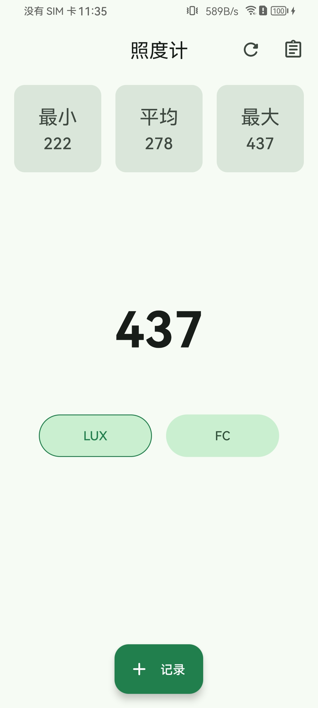
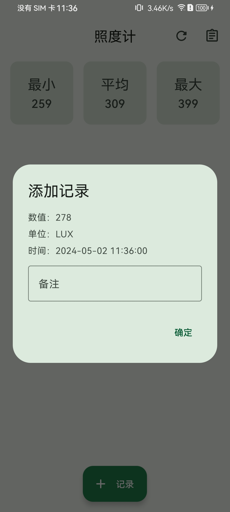
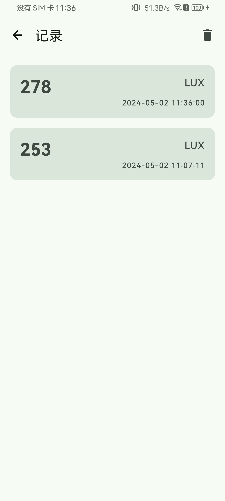
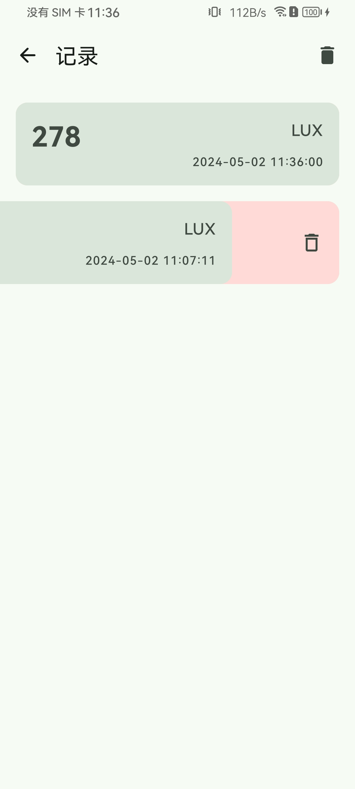

# Illuminometer

An app that uses the Android phone's light sensor to detect the current ambient light intensity,
mainly used to check whether my plants are receiving the appropriate light intensity under the grow
lights.

Supports two light intensity units: Lux and FC(Foot Candles).

The illuminance $E_v$ in foot candles (fc) is equal to the illuminance $E_v$ in lux (lx) times *
*0.09290304**:

$$
E_v(fc) = E_v(lx) * 0.09290304
$$

## Screenshot

    
    
    
    

## Todo

- [x] detect record

## License

    Copyright 2024 WangZhiYao
    
    Licensed under the Apache License, Version 2.0 (the "License");
    you may not use this file except in compliance with the License.
    You may obtain a copy of the License at
    
        http://www.apache.org/licenses/LICENSE-2.0
    
    Unless required by applicable law or agreed to in writing, software
    distributed under the License is distributed on an "AS IS" BASIS,
    WITHOUT WARRANTIES OR CONDITIONS OF ANY KIND, either express or implied.
    See the License for the specific language governing permissions and
    limitations under the License.